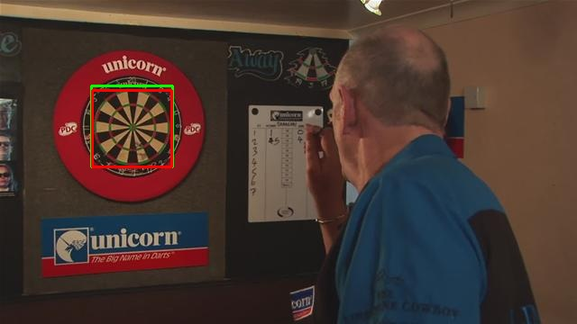

# Building a Dartboard Dectector

## About
Image detection for dartboards. More information can be found in **report.pdf**. Build by using techniques such as Viola-Jones and Circle, Intercention Hough spaces. *Created using C++ with [OpenCV](http://opencv.org/).* Here's an example where the detection is in green and ground truth in red.

 
 
    
 

## How to run

To compile use *Makefile*
`makefile`

Run the program on an image. This will output a new image *detected.jpg*:
`./a.out <imageName>`

To run for all images:
`make runall`
